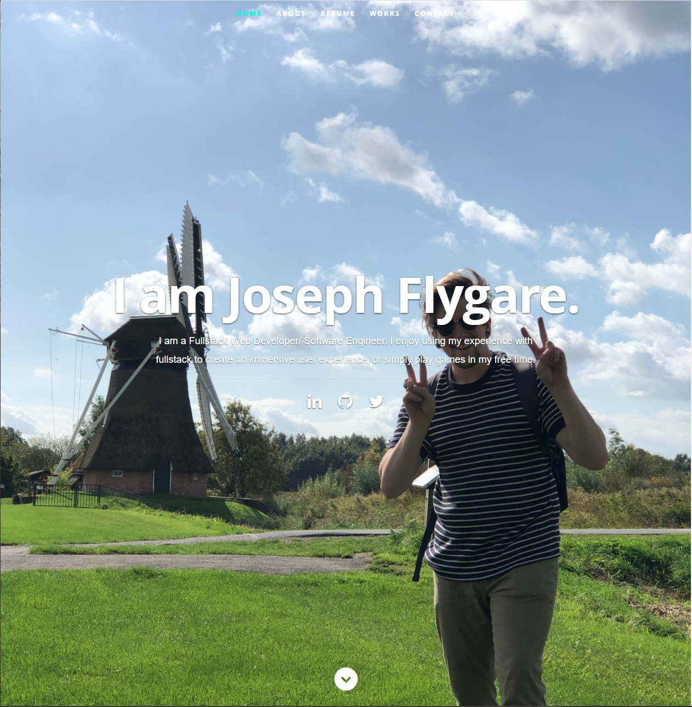

# React Portfolio

 

## Description
This is a portfolio website constructed by me for potential employers or clients to peruse my work and get into contact with me. It was built using the amazing frontend framework known as React.js.

## **Table of Contents**

1. [Usage](#usage)
2. [License](#license)
3. [Contributors](#contributors)
4. [Technologies](#technologies)
5. [Visuals](#visuals)
6. [Demos](#demos)
7. [Links](#links)

## **Usage**
Here is a link to the site if you'd like to have a gander! https://joeyflygare.github.io/Responsive-Portfolio/

## **License**
Copyright (c) 2021, Joseph Flygare

## **Contributors**
Joseph Flygare
* Wow amazing!

## **Technologies**
* React.js
* Node
* Javascript

## **Questions**
Contact our team at jayfly64@gmail.com for any questions 

## **Visuals**

